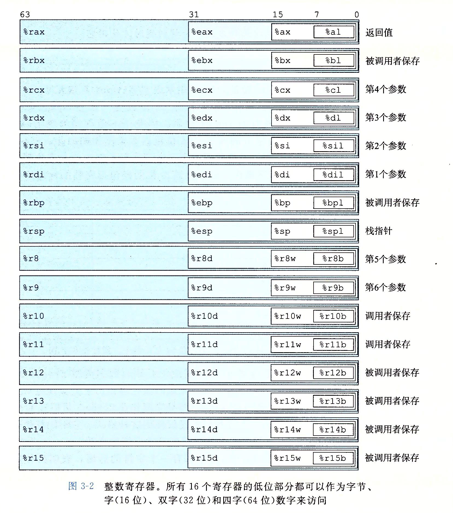
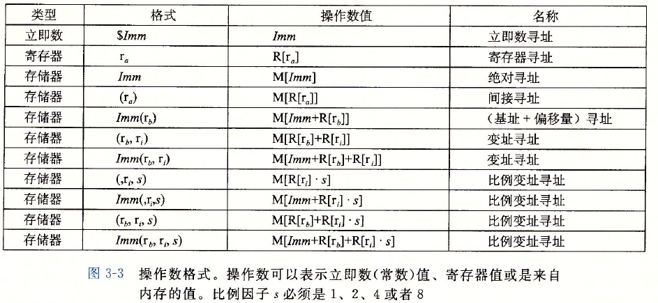
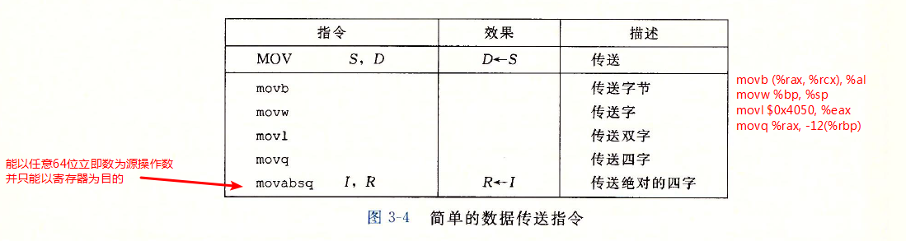
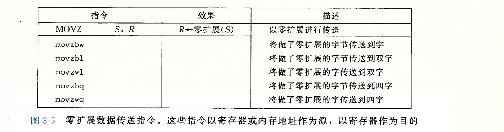
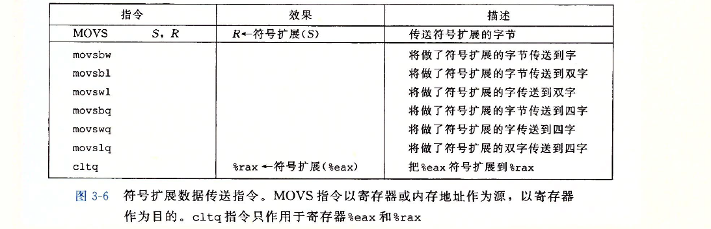
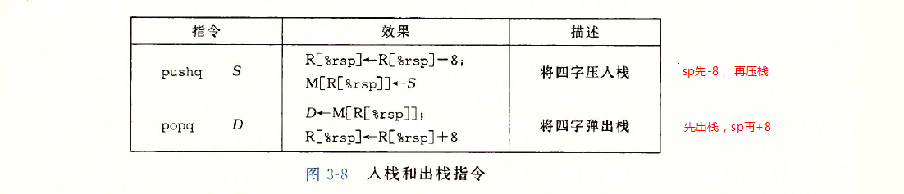
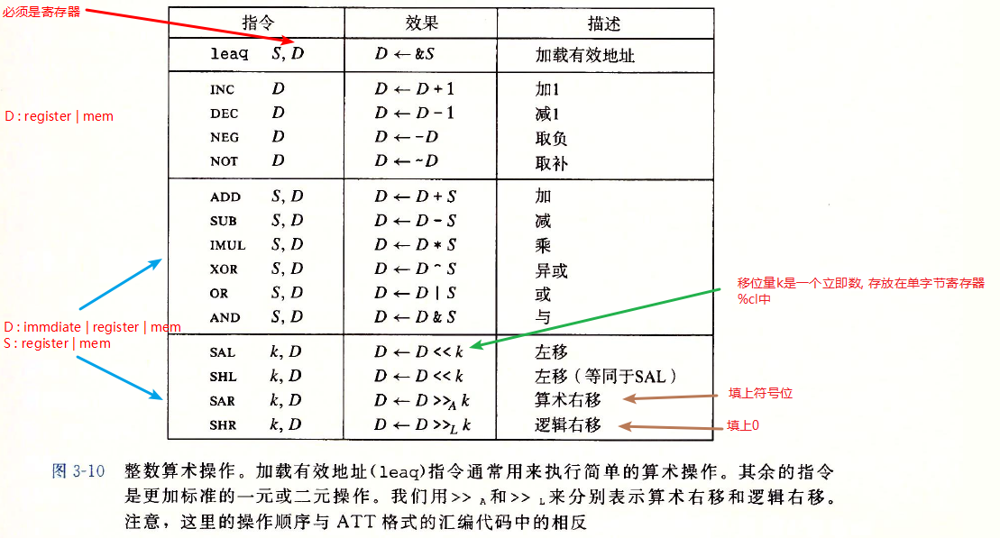

程序指的是，能在机器上跑的一段代码，通常，由程序员编写的程序我们称其为源代码（source code），这种源码是一种文本形式的代码，目的是方便人类编辑与阅读，但是其不能被机器所识别，如何将源码转换成机器能够识别的机器码（我们称其为二进制码，binary），这里需要通过编译器来将文本形式的源码转换成二进制码，如以下Unix编译命令：

`linux> gcc -Og -o p p1.c p2.c`

其中，gcc表示GCC C编译器，是Linux上默认的编译器，－Og表示告诉编译器生成符合原始C代码整体结构的机器代码的优化等级。

其实，这条命令要经过以下4步才能生成二进制代码：

1. 预处理：扩展源码，插入所有用#include命令指定的文件，展开所有用#define声明宏定义

2. 编译（这是狭义上的编译）：将.c文件转换成.S文件（汇编文件）

3. 汇编：将.s文件转换成.o文件（二进制目标代码文件），但此时的.o文件还不能进行

4. 链接：在此阶段，链接器会将这2个目标代码文件和库函数代码合并，填入全局变量的地址，加上链接地址，此时文件叫obj文件

---

由于真正的机器码是难以阅读和编程的，因此，汇编语言也就诞生了。汇编是和硬件平台相关（cpu架构、指令集等）的，汇编和机器码之间建立了一定的映射关系，每条指令一一对应一条机器码，汇编更接近人类的思维模式，因此易于编程和阅读（相对于机器码）。

虽然汇编比机器语言高效，但是，由于其频繁的操作寄存器等原因，难以应用于大规模的软件工程中，并且与平台相关，编写的程序无法通用，移植性不高。因此C语言诞生了（其实中间还有B语言……）

相对来说C语言的不用操作寄存器，隐藏了大多数硬件层的信息，从而C语言的平台通用性更好，同时语法接近人类语言，因此广泛应用。目前大部分底层机器程序和几乎所有的OS都是C语言编写的。

---

作为一名合格的程序员（码农），用高级语言时也有必要了解其底层代码的实现，了解C通过编译器生成的汇编代码的结构和执行的效率问题。

汇编根据平台可以分成好几种（目前我个人接触过的）：

1. x86汇编

   其中，根据语法细分可以分为AT&T格式汇编（csapp主要用这种格式）和intel格式汇编（这之前学习的王爽老师的《汇编语言》），两者最显著的区别就是Intel格式省略了寄存器前的%，还有就是操作数的顺序正好是相反的。

   1. 16位（实模式）

   2. 32位（保护模式）

   3. 64位（x86-64）

2. arm汇编

**PS : 本文用的汇编即AT&T格式的x86-64汇编 ！！！**

---

# 1. 寄存器和寻址方式



寻址方式：<br>



## 2. 指令

### 2.1 数据传送指令

1. 简单的传送指令——mov类，把数据从源位置复制到目的位置，不做任何变化：<br>

   

2. 零扩展movz

   从源复制到目的寄存器，把目的中剩余的字节填充为0<br>

   

3. 符号扩展movs

   从源复制到目的寄存器，把源操作数的最高位进行复制<br>

   

   **EXAMPLES:**

   ```
   C语言中经常会出现强制类型转换，大致可分为以下几种：
   1. 符号相同并伴随大小变化，即unsigned char->unsigned int, long->short
      扩展直接用movs | movz，缩小用mov
   2. 符号不同并伴随大小变化(C语言规定当执行强制类型转换时既涉及大小变化以涉及符号变化时，应先改变      大小)
      1. 从大到小，eg: unsigned int->char
         用mov
      2. 从小到大，eg: char->unsiged int, unsigned char->int
         用movz | movs
   ```

### 2.2 栈操作

栈是一种数据结构，大多数栈都是向下增长的，即与地址增加方向相反<br>



### 2.3 算术与逻辑运算操作




## 3. 控制

## 4. 过程

## 5. 数据结构在内存中的分配

### 5.1 数组array

1. 一维数据

2. 二维数组

3. 变长数组

### 5.2 结构体struct

### 5.3 联合union

### 5.4 数据对齐
