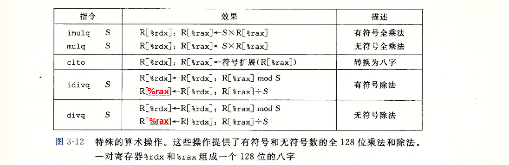

程序指的是，能在机器上跑的一段代码，通常，由程序员编写的程序我们称其为源代码（source code），这种源码是一种文本形式的代码，目的是方便人类编辑与阅读，但是其不能被机器所识别，如何将源码转换成机器能够识别的机器码（我们称其为二进制码，binary），这里需要通过编译器来将文本形式的源码转换成二进制码，如以下Unix编译命令：

`linux> gcc -Og -o p p1.c p2.c`

其中，gcc表示GCC C编译器，是Linux上默认的编译器，－Og表示告诉编译器生成符合原始C代码整体结构的机器代码的优化等级。

其实，这条命令要经过以下4步才能生成二进制代码：

1. 预处理：扩展源码，插入所有用#include命令指定的文件，展开所有用#define声明宏定义

2. 编译（这是狭义上的编译）：将.c文件转换成.S文件（汇编文件）

3. 汇编：将.s文件转换成.o文件（二进制目标代码文件），但此时的.o文件还不能进行

4. 链接：在此阶段，链接器会将这2个目标代码文件和库函数代码合并，填入全局变量的地址，加上链接地址，此时文件叫obj文件

---

由于真正的机器码是难以阅读和编程的，因此，汇编语言也就诞生了。汇编是和硬件平台相关（cpu架构、指令集等）的，汇编和机器码之间建立了一定的映射关系，每条指令一一对应一条机器码，汇编更接近人类的思维模式，因此易于编程和阅读（相对于机器码）。

虽然汇编比机器语言高效，但是，由于其频繁的操作寄存器等原因，难以应用于大规模的软件工程中，并且与平台相关，编写的程序无法通用，移植性不高。因此C语言诞生了（其实中间还有B语言……）

相对来说C语言的不用操作寄存器，隐藏了大多数硬件层的信息，从而C语言的平台通用性更好，同时语法接近人类语言，因此广泛应用。目前大部分底层机器程序和几乎所有的OS都是C语言编写的。

---

作为一名合格的程序员（码农），用高级语言时也有必要了解其底层代码的实现，了解C通过编译器生成的汇编代码的结构和执行的效率问题。

汇编根据平台可以分成好几种（目前我个人接触过的）：

1. x86汇编

   其中，根据语法细分可以分为AT&T格式汇编（csapp主要用这种格式）和intel格式汇编（这之前学习的王爽老师的《汇编语言》），两者最显著的区别就是Intel格式省略了寄存器前的%，还有就是操作数的顺序正好是相反的。

   1. 16位（实模式）

   2. 32位（保护模式）

   3. 64位（x86-64）

2. arm汇编

**PS : 本文用的汇编即AT&T格式的x86-64汇编 ！！！**

---

# 1. 寄存器和寻址方式


寻址方式：<br>


## 2. 指令

### 2.1 数据传送指令

1. 简单的传送指令——mov类，把数据从源位置复制到目的位置，不做任何变化：<br>

   

2. 零扩展movz

   从源复制到目的寄存器，把目的中剩余的字节填充为0<br>

   

3. 符号扩展movs

   从源复制到目的寄存器，把源操作数的最高位进行复制<br>

   

   **EXAMPLES:**

   ```
   C语言中经常会出现强制类型转换，大致可分为以下几种：
   1. 符号相同并伴随大小变化，即unsigned char->unsigned int, long->short
      扩展直接用movs | movz，缩小用mov
   2. 符号不同并伴随大小变化(C语言规定当执行强制类型转换时既涉及大小变化以涉及符号变化时，应先改变      大小)
      1. 从大到小，eg: unsigned int->char
         用mov
      2. 从小到大，eg: char->unsiged int, unsigned char->int
         用movz | movs
   ```

### 2.2 栈操作

栈是一种数据结构，大多数栈都是向下增长的，即与地址增加方向相反<br>


### 2.3 算术与逻辑运算操作




## 3. 控制

众所周知，我们编写的程序不总是从头执行到尾的，它更多的是跳跃执行的，根据一定的判断条件，进行跳转，如if / while循环等等，那它们的底层实现是如何的呢？

它们是通过条件码来进行控制是否跳转的。

CPU中，除了一些通用的寄存器，还有一种PSW的，程序状态寄存器，它记录着程序执行的状态位：

```
CF : if 进位，     set 1 else set 0
ZF : if 结果为0，  set 1 else set 0
SF : if 结果小于0， set 1 else set 0
OF : if 有补码溢出，set 1 else set 0
```

### 3.1 指令

1. cmp 和 test

   这2个指令只会根据结果设置相应的条件码，而不会更新寄存器的值

   

2. set

   

3. jump

   

   ### 3.2 两种条件分支的实现的比较

   1. 条件控制实现条件分支

      先判断条件的成立与否，然后执行相应的代码段，如C语言的 if / else语句

      其汇编实现伪代码：

      ```
      t = test-expr    //测试结果
      if (!t)
          goto false
      then-statement
      goto done
      false:
          else-statement
      done:
          ...
      ```

   2. 条件传送实现条件分支

      针对条件的2种对立情况，都进行执行计算，并将计算结果保存在变量中，最后进行判断，如果之前预判正确，则不必赋值，反之的将变量赋成另一个值

      其示例C代码：

      ```
      long abs(long x, long y)
      {
          long result;
          if (x < y)
              result = y - x;
          else
              result = x - y;
          return result;
      }
      ```

      其汇编实现伪代码：

      ```
      v = then-expr    //then 执行的结果
      ve = else-expr
      t = test-expr
      if (!t)
          v = ve
      ```

      条件传送涉及的指令：

      

      **两种实现方式的比较：**

      各有优缺点。

      当then-statement和else-statement代码量比较大时；有些情况下只能用前者实现（用后者实现时，如果条件预判错误，可能会导致非法指令），则用条件控制。但用条件控制，由于cpu要根据条件判断结果来执行相应的代码，如果预判出错，则流水线上预取的指令要放弃，这样就损失了效率。

      因此当then-statement和else-statement代码量比较小且计算简单时，用条件传送会大大增加效率。但是它只能用于非常受限的情况，但是这些情况还是比较常见的，且与现代处理器的运行方式更契合。

      ### 3.3 循环和开关

      1. do-while

         其汇编实现伪代码：

         ```asm6502
         loop:
             body-statement
             t = test-expr
             if (t)    
                 goto loop
         ```

      2. while

         有2种实现方法：

         1. jump-to-middle

            其汇编实现伪代码：

            ```
            goto test
            loop:
                body-statement
            test:
                t = test-expr
                if (t)
                    goto loop
            ```

         2. guarded-do

            其汇编实现伪代码：

            ```
            t = test-expr
            if (!t)
                goto done
            loop:
                body-statement
                t = test-expr
                if (t)
                    goto loop
            done:
                ...
            ```

      3. for

         for循环其实可以转换成while来实现，如下，先初始化相应变量，然后进入while

         ```
         init-expr    //初始化变量
         while (test-expr)
         {
             body-statement
             update-expr    //更新变量
         }
         ```

         同样的，for 也能用while的2种汇编实现方式实现，在此不再赘述。

      4. switch

         switch是一种开关语句，它可以根据一个整数索引值进行多重分支。具体实现是通过一种**跳转表**的数据结构实现的，这种方式更加高效。

         **跳转表**实际上是一个数组，表项i是一个代码段的地址，当switch(a)中的a ＝ i时，则跳转执行i指向的代码段

         GCC会根据开关情况的数量和开关情况值的稀疏程序来翻译此语句。当开关数量大于4个，且值的跨度范围较小时，就会使用跳转表。

         

## 4. 过程

C是一种面向过程的编程语言，因此过程是一种很重要的抽象。过程的形式分很多种，如函数、子例程、处理函数……

在这里，主要讨论过程调用与返回时，底层是如何实现的？主要通过栈来实现过程调用和返回。


**对于x86-64来说：**

当P调用Q时

1.  P向Q传递参数，当参数个数<=6时，使用寄存器传递，传递顺序为参数1－参数6：%rdi, %rsi, %rdx, %rcx, %r8, %r9； 当参数个数>6时，如8个，则从右到左依次入栈，即第8个参数在%sp+16，第7个参数在%sp+8

2. 然后，再向栈中压入调用指令的下一条指令的地址，即返回地址，跳到Q执行

3. Q执行完毕，释放当时P向Q传入参数在栈中占用的空间，并执行汇编指令ret，弹出返回地址并返回相应的返回值（如果有的话），继续执行P

关于调用过程中x86-64的寄存器使用惯例：分成被调用者寄存器和调用者寄存器

1. 被调用者寄存器（%rbx, %rbp, %r12 - %r15）<br>当P调用Q时，Q必须保存这些寄存器，以保证返回时和调用时一样。具体实现：要么在Q中不使用；要么压栈保存，返回时弹出。

2. 调用者寄存器（除被调用者寄存器和%sp外的寄存器）<br>P在这些寄存器中有局部数据，在被调用Q能修改它们，因此P（调用者）有责任保存它们

## 5. 数据结构在内存中的分配

### 5.1 数组array

1. 一维数据

2. 二维数组

3. 变长数组

### 5.2 结构体struct

### 5.3 联合union

### 5.4 数据对齐
